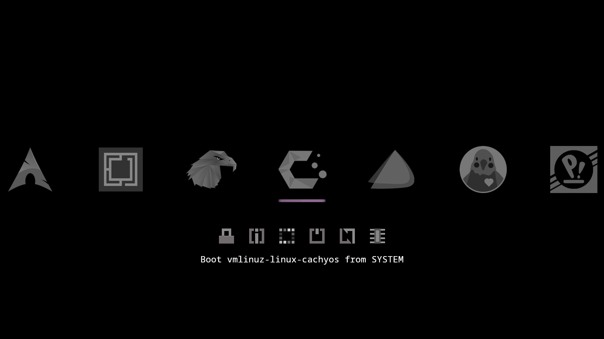
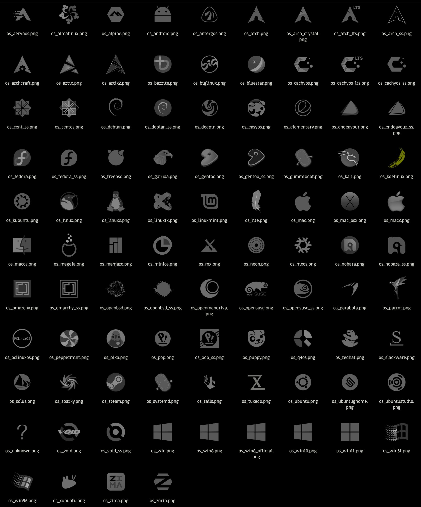

# Refind OLED No Blind Me

A less bright theme for the Refind Boot Manager

Large icons for 50+ distros are included. There are additional, even more minimalist icons for some distros that can be paired with a Btrfs snapshot.

### Installation

Copy the theme folder to a `themes` directory inside the refind EFI directory (usually `/boot/EFI/refind`)

**Example**
>                                               
	sudo mkdir /boot/EFI/refind/themes                        (ignore command or error if directory exists)
	sudo cp -r ./RONBM /boot/EFI/refind/themes/RONBM		  (right click to open terminal in downloads folder)

Then add `include themes/RONBM/theme.conf` at the end of /boot/EFI/refind/refind.conf
>

	sudo nano /boot/EFI/refind/refind.conf                    (ctrl+u to paste, ctrl+s to save, ctrl+x to exit)

### Customization

Open /RONBM/theme.conf and follow directions to edit:

* Show/hide label text (shown by default, this is the text in the preview)
* Show/hide hints (hidden by default, additional text at the bottom of the screen)
* Indicator style (there are two additional sets of indicator images, flat geometric & HUD)
* Icon size (256px default size relatively large for refind, but not very big on a HiDPI monitor)
* Maximum number of icons shown (default 7 should fit like the preview on a 1080p monitor)
* Timeout before automatic boot

May want to resize background.png to monitor resolution. There is an activity dot in the top right corner (doesn't really serve any practical purpose) that can be kept or cropped out.

### Setting Custom Icons

If the specific icon isn't automatically applied for a distro, the easiest solution is just to rename the correct one to os_linux.png or os_unknown.png. 

More extensive fixes can be done by adding a boot stanza to /boot/EFI/refind/refind.conf

**Example**
>

	menuentry " ****** " {                                      (replace ****** with OS name)
		icon /EFI/refind/themes/RONBM/icons/******.png          (replace ****** with icon name)
	    loader /vmlinuz-linux-******                            (replace ****** to match file name in /boot )
	    initrd /initramfs-linux-******.img                      (replace ****** to match file name in /boot )
	    options "quiet ******"                                  (replace "quiet ******" with boot options)
	    }
    
Boot options may be found in refind_linux.conf (sudo nano /boot/refind_linux.conf).   After booting into an OS copy the long string in quotes after "Boot with standard options"

